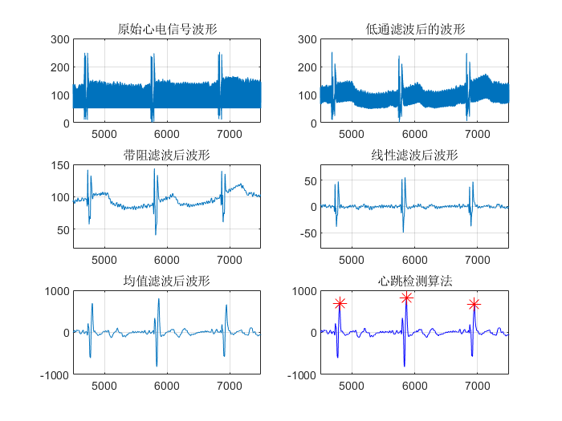
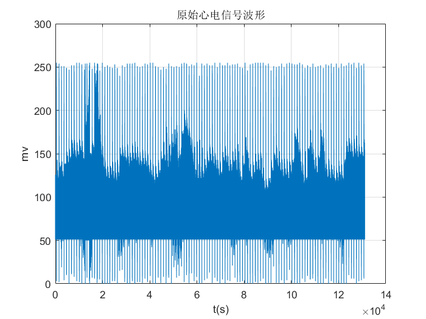
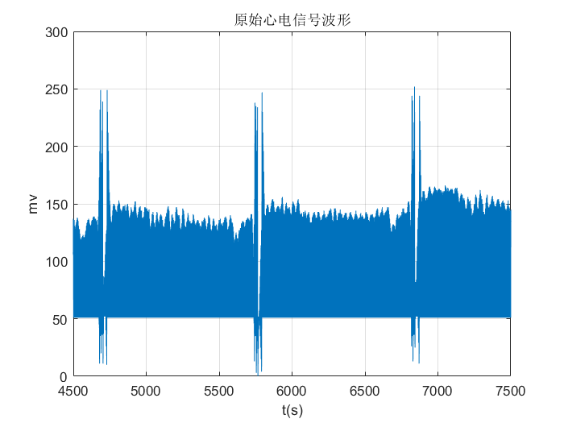
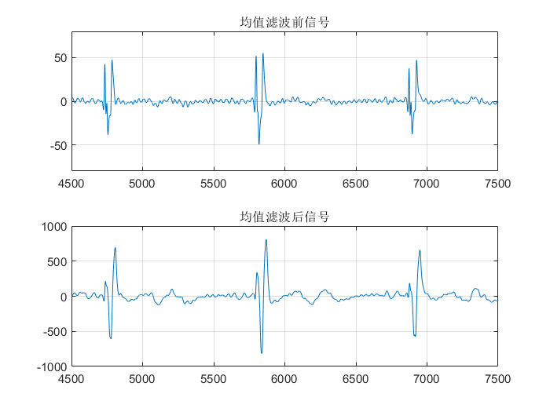
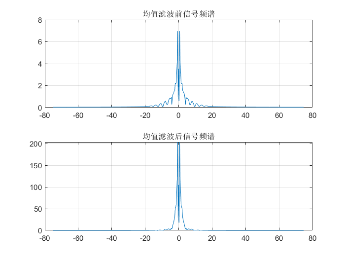
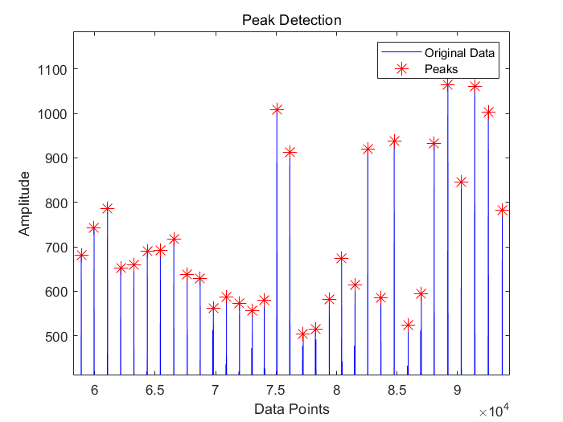
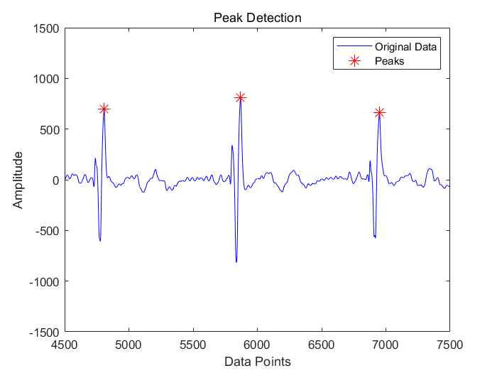
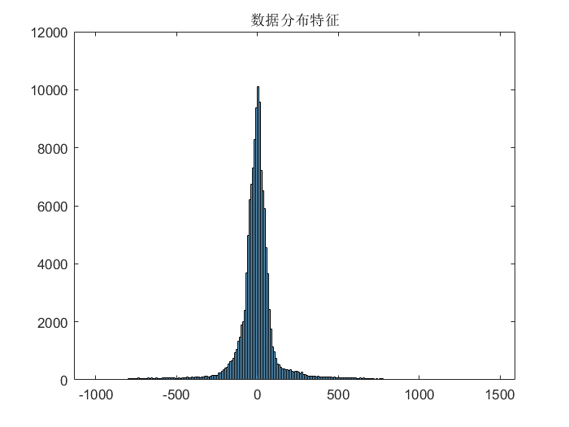

# 基于MATLAB的心电信号处理与心率计算

### 一、总览

### 二、原始心电信号分析

### 三、低通滤波去除肌电信号

### 四、带阻滤波去除工频信号

### 五、去除直流分量与基线漂移

### 六、均值滤波平滑信号

### 七、心跳检测与心率计算

### 九、特征提取

心跳间隔的均值是: 1098.487395
心跳间隔的标准差是: 128.500074
心跳间隔的变异系数（CV）是: 0.116979
区间连续差的标准差（RMSSD）是: 185.847942
低频功率是: 24861696.585483
高频功率是: 9389767.514993
功率比是: 2.647744
偏度值是: 0.656242
熵值是: 1.115662

